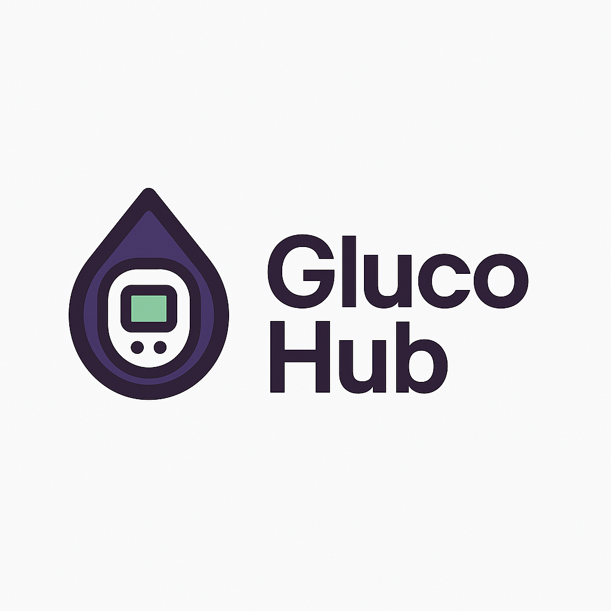

# GlucoHub

**GlucoHub** provides advanced visualization, logging, and recovery tools for blood glucose, meals, and activity data, all in a user-friendly, mobile-friendly interface. It builds on top of Nightscout, providing additional features and analysis.

## Core Features

- **24-Hour Blood Glucose Chart:**  
  Visualize continuous glucose monitor (CGM) and manual blood glucose (MBG) readings on a detailed, interactive 24-hour timeline. Includes customizable target zones, meal markers, and activity overlays.

- **Time Wheel Chart:**  
  A unique circular "time wheel" visualization for spotting daily glucose and meal patterns at a glance.

- **Meal Logging & Visualization:**  
  Log meals and view them alongside glucose data. See macronutrient breakdowns and meal timing in context.

- **Activity & Heart Rate Integration:**  
  Overlay steps and heart rate data (from CSV or simulated sources) to correlate activity with glucose trends.

- **Advanced Tooltips & Data Exploration:**  
  Hover or tap on chart points to see detailed tooltips with glucose values, meal details, and activity info.

- **Modern, Responsive UI:**  
  Built with React and Material UI, featuring a sidebar navigation, dark mode, and mobile-friendly layouts.

- **Data Import & Recovery:**  
  Import data from Nightscout, CSV files, or use built-in dummy data for demo/testing.

- **Private by Default:**  
  All data is processed client-side; no data is sent to external servers unless configured.

## Current Status

- **Feature Completeness:**  
  - Core charting and meal logging features are implemented and stable.
  - Data import, export, and recovery tools are available.
  - UI/UX is modern and responsive, but some advanced features (user authentication, real-time sync, etc.) are in development.

- **Deployment:**  
  Ready for deployment on Vercel, Render, or similar platforms. Requires access to a Nightscout instance and API Secret 

## Nightscout API Secret Security

GlucoHub is designed with privacy and security in mind. When you connect GlucoHub to your Nightscout instance, you may need to provide your Nightscout API Secret to access protected endpoints (such as meal logging or data import/export).

**How GlucoHub uses your API Secret:**

- **Client-Side Only:**  
  The API Secret is used exclusively in your browser (client-side). It is never sent to any third-party server, including GlucoHub's own hosting or analytics.
- **Temporary Storage:**  
  The API Secret is typically stored in your browser's memory (React state or context) for the duration of your session. It may also be stored in `localStorage` or `sessionStorage` if you choose to "remember" your connection, but it never leaves your device.
- **No External Transmission:**  
  The API Secret is only used to sign or authenticate requests directly to your own Nightscout server. It is never transmitted to any service other than your Nightscout instance.
- **Open Source & Auditable:**  
  You can review the code to verify that the API Secret is not sent anywhere except your Nightscout server.

**Best Practices:**
- Only use GlucoHub on devices you trust.
- If you use a shared or public computer, do not select any "remember me" options for your API Secret.
- You can always clear your browser storage to remove any saved credentials.

## Roadmap

- Nightscout API integration for real-time data sync [DONE]
- User authentication to the GlucoHub front end [will add OAuth]
- Enhanced analytics and reporting
- Mobile app version [Optimizing code to work on mobile]

This project was built with Cursor AI - I take no credit for any coding.

## Available Scripts

In the project directory, you can run:

### `npm start`

Runs the app in the development mode.\
Open [http://localhost:3000](http://localhost:3000) to view it in your browser.

The page will reload when you make changes.\
You may also see any lint errors in the console.

### `npm test`

Launches the test runner in the interactive watch mode.\
See the section about [running tests](https://facebook.github.io/create-react-app/docs/running-tests) for more information.

### `npm run build`

Builds the app for production to the `build` folder.\
It correctly bundles React in production mode and optimizes the build for the best performance.

The build is minified and the filenames include the hashes.\
Your app is ready to be deployed!

See the section about [deployment](https://facebook.github.io/create-react-app/docs/deployment) for more information.

### `npm run eject`

**Note: this is a one-way operation. Once you `eject`, you can't go back!**

If you aren't satisfied with the build tool and configuration choices, you can `eject` at any time. This command will remove the single build dependency from your project.

Instead, it will copy all the configuration files and the transitive dependencies (webpack, Babel, ESLint, etc) right into your project so you have full control over them. All of the commands except `eject` will still work, but they will point to the copied scripts so you can tweak them. At this point you're on your own.

You don't have to ever use `eject`. The curated feature set is suitable for small and middle deployments, and you shouldn't feel obligated to use this feature. However we understand that this tool wouldn't be useful if you couldn't customize it when you are ready for it.

